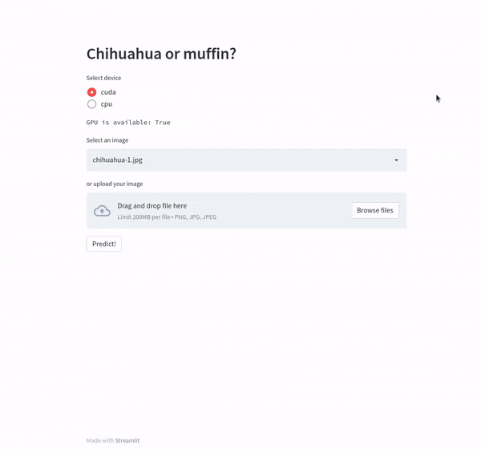

# Cuda Guide

In this project, we will configure CUDA for docker. The repository contains a Streamlit demo application for image classification. Also it contains code for training on pytorch lightning

## Requirements

- Ubuntu 20.04
- GPU supported by Pytorch
- Docker
- Python >= 3.61
- Clone repo and `cd cuda_guide`
- Donwload the model
    ```
    wget https://github.com/andBabaev/cuda_guide/releases/download/v0.1/model.ckpt -P models
    ```

## Environment setup

1. Install Nvidia driver
```
sudo apt update && sudo apt upgrade -y
sudo add-apt-repository ppa:graphics-drivers/ppa -y
sudo apt update
sudo apt install nvidia-driver-510
sudo reboot
```

2. Install Docker
```
sudo apt-get update
sudo apt-get install ca-certificates curl gnupg lsb-release
echo "deb [arch=$(dpkg --print-architecture) signed-by=/usr/share/keyrings/docker-archive-keyring.gpg] https://download.docker.com/linux/ubuntu $  (lsb_release -cs) stable" | sudo tee /etc/apt/sources.list.d/docker.list > /dev/null
sudo apt-get update
sudo apt-get install docker-ce docker-ce-cli containerd.io
sudo usermod -aG docker ${USER}
su - ${USER}
```

3. Install nvidia-container-toolkit
```
distribution=$(. /etc/os-release;echo $ID$VERSION_ID)
curl -s -L https://nvidia.github.io/nvidia-docker/gpgkey | sudo apt-key add -
curl -s -L https://nvidia.github.io/nvidia-docker/$distribution/nvidia-docker.list | sudo tee /etc/apt/sources.list.d/nvidia-docker.list
sudo apt-get update && sudo apt-get install -y nvidia-container-toolkit
sudo systemctl restart docker
```

## Run app
### Without Docker
```
pip install -r requirements/requirements-train.txt --no-cache-dir
streamlit run app.py
```

### With an Nvidia based Docker image
```
docker build -t cuda_guide_nvidia -f Dockerfile.app.nvidia .
docker run -p 8501:8501 --gpus all -it cuda_guide_nvidia:latest
```

### With a Pytorch based Docker image
```
docker build -t cuda_guide_torch -f Dockerfile.app.torch .
docker run -p 8501:8501 --gpus all -it cuda_guide_torch:latest
```


## Train
```
docker build -t cuda_guide_train -f Dockerfiles/Dockerfile.train .
docker run \
    -v ${PWD}/models:/app/models \
    -v ${PWD}/train:/app/train \
    -p 9999:9999 \
    --gpus all \
    --name cuda_guide_train -it cuda_guide_train:latest
```
The code for training is in `train/train.ipynb` file

## Useful links:
- [File Upload / Download with Streamlit](https://pythonwife.com/file-upload-download-with-streamlit/#:~:text=To%20upload%20an%20image%20we,jpeg%20are%20the%20accepted%20extensions.)

- [dog or muffin dataset](https://github.com/ieee8023/deep-learning-datasets)